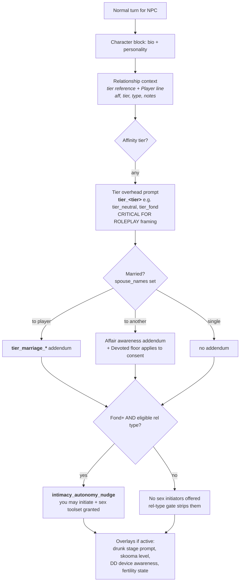
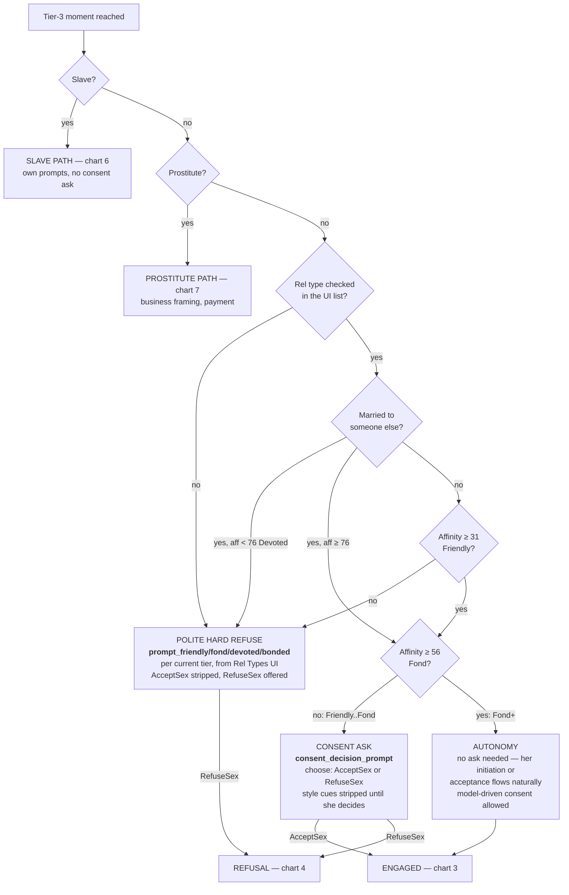
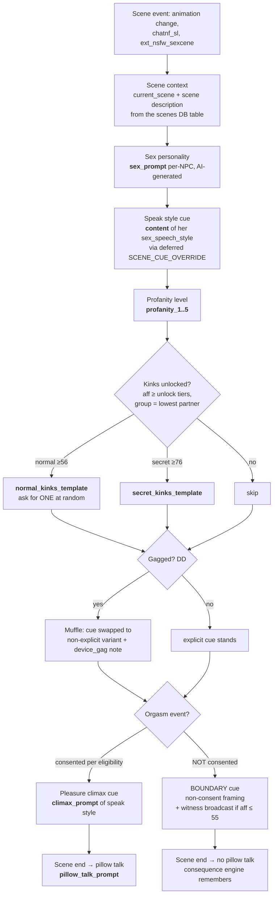
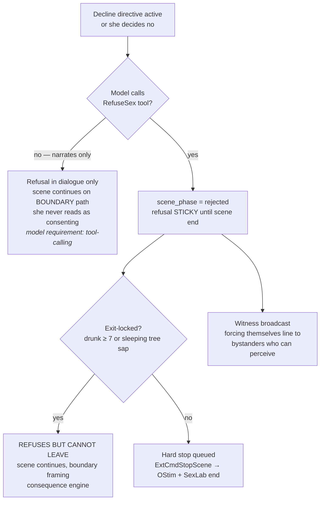
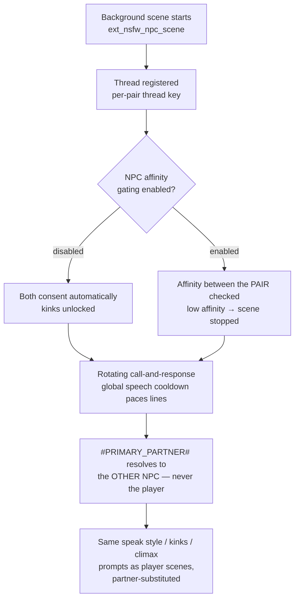
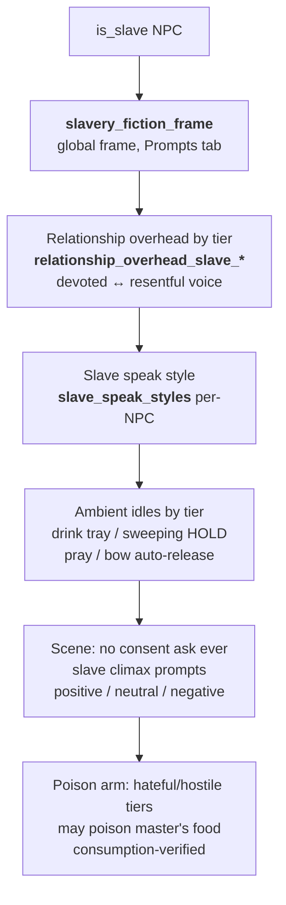
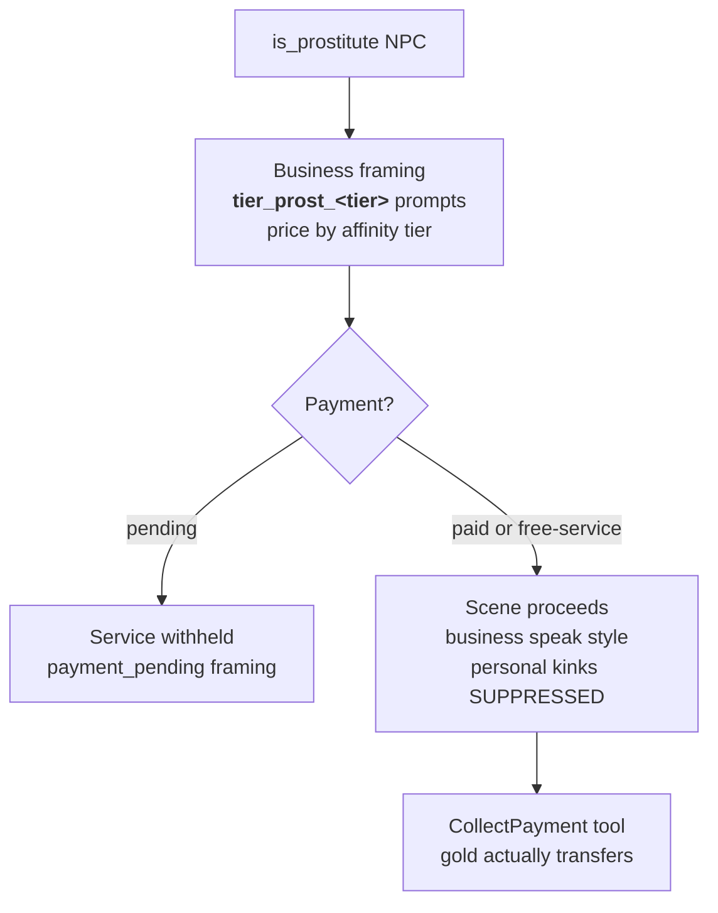
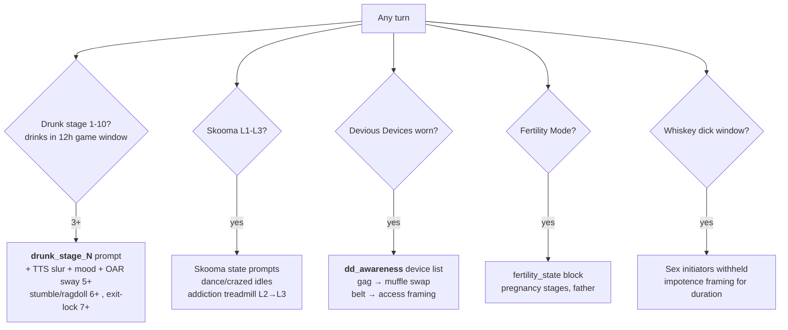

# SHARMAT — Prompt Flow Charts

One chart per path. Every box that injects text names the prompt key(s) involved (all editable in the UI;
reset buttons restore shipped defaults). Built 2026-07-02 against the live system.

---

## 1. Player → NPC: normal (non-scene) turn

What stacks into her context on an ordinary chat turn.

---

## 2. Player → NPC: the consent ladder (scene attempt / tier-3 moment)

Evaluated the moment intimacy escalates to tier 3 (explicit). This is THE decision tree.

---

## 3. In-scene turn (accepted / engaged)

---

## 4. Refusal path

---

## 5. NPC → NPC scenes

---

## 6. Slave path (own system — consent ladder does not apply)

---

## 7. Prostitute path (own system)

---

## 8. Overlays that layer onto ANY path

---

### Reading order for newcomers
Chart 1 is every ordinary conversation. Chart 2 is the single most important one — it decides
whether intimacy can even happen. Charts 3/4 are inside and out of scenes. 6/7 replace chart 2
entirely for flagged NPCs. Chart 8 rides on top of everything.
